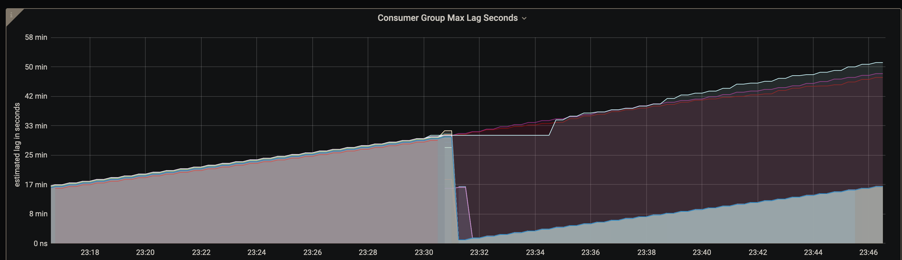

# Kafka Lag Exporter Standalone

A docker compose with [Kafka Lag Exporter] + [Prometheus] + [Grafana] + a [Dashboard](https://github.com/lightbend/kafka-lag-exporter/tree/master/grafana) to view the latency of your Apache Kafka consumer groups. Useful tool for monitoring and troubleshooting a Kafka deployment in a few easy steps.

### Why this docker compose?

This repo brings [Kafka Lag Exporter], [Prometheus] and [Grafana] together in one single docker compose, so you can quickly start it up and start analyzing an issue on a Kafka deployment. Otherwise, you would need to start and configure each piece separatly, which could be a bit cumbersome.

It aims to provide a quick installation for troubleshooting and not a final installation for permanent monitoring. It's perfect if you are facing an issue in production and need more visibility about what is happening internally in kafka.

### Example use cases


#### Consumer group lag in seconds



Here is an example from one of the Grafana dashboards provided. 
In this dashboard we can see the time between last commit and current time, this is also known as lag in seconds, 
and we can see it by consumer group. 
This example was taken from a Kafka-Connect that commits every 30 minutes if everything goes well, 
if we analize it we can say that some consumer groups by some reason fail on commit.

#### Consumers group lag in seconds and offsets


In this other example, we can see a particular consumer group status, 
it shows the consumer group lag in seconds and messages/events (the difference between current message and last commited)

### Getting started

1. Download your desired version and unpack it:

```bash
curl -fsSL -o kafka-lag-exporter-standalone.tar.gz https://github.com/cspinetta/kafka-lag-exporter-standalone/releases/download/0.0.1/kafka-lag-exporter-standalone-0.0.1.tar
tar -xf kafka-lag-exporter-standalone.tar.gz
```

2. Specify kafka nodes on [kafka-exporter-standalone/kafka-lag-exporter/application.conf].
3. Run with docker compose: `docker-compose -f kafka-exporter-standalone/docker-compose.yaml up`.

Then you can open the Grafana webapp exposed at port `3000` and navigate to the dashboard **Kafka Lag Exporter**.

On the first time you enter Grafana ask you to login. Type `admin` for the username and password. Then Grafana will ask you to choose a new password.

[Kafka Lag Exporter]: https://github.com/lightbend/kafka-lag-exporter
[Prometheus]: https://prometheus.io/
[Grafana]: https://grafana.com/
[kafka-exporter-standalone/kafka-lag-exporter/application.conf]: kafka-exporter-standalone/kafka-lag-exporter/application.conf
[kafka-exporter-standalone/docker-compose.yaml]: kafka-exporter-standalone/docker-compose.yaml
